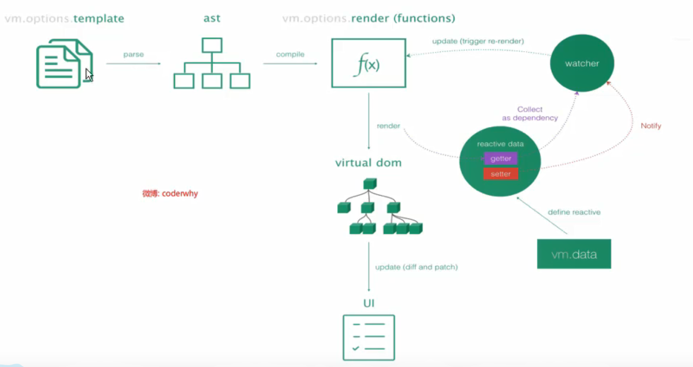

## Vue-cli
* CLI是什么？
  * CLI是Command-Line Interface，翻译为命令行界面，俗称脚手架
  * 使用vue-cli可以快速搭建Vue开发环境以及对应的webpack配置。
  * 脚手架依赖于node和webpack

## Vue CLI的使用

* 安装

  ```javascript
  npm install -g @vue/cli
  ```

* 创建项目

  ```javascript
  vue init webpack (文件名) 
  ```

  

## runtimecompiler和runtimeonly的区别



* vue运行流程

  template -> ast -> render函数 -> virtual dom -> ui

## Vue CLI3

* vue-cli3 设计原则是'0配置'，移除的配置文件根目录下的build和config等目录。
* vue-cli3提供了vue ui命令，提供了可视化配置，更加人性化。
* 移除了static文件夹，新增了public文件夹，并且index.html移动到public中。

* 创建项目

  ```javascript
  vue create 项目名称
  ```

  

## CLI3的配置

* 运行vue ui 图形化操作界面

* 修改配置
  * 创建 vue.config.js文件
  * 在里面module.esports 修改配置