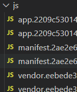
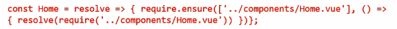
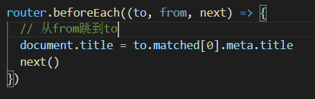

## Vue-router

## 一、什么是路由

* 路由就是通过互联的网络把信息从源地址传输到目的地址的活动。
* 路由器的两种机制：
  * 路由是决定数据包从来源到目的地的路径。
  * 转送将输入端的数据转移到合适的输出端。
* 路由表本质上就是一个映射表，决定了数据包的指向。

### 前端渲染和后端渲染

* 后端路由阶段

  * 后端处理URL和页面之间的映射关系。

    

  * 一个页面有自己对应的网址，也就是URL。

  * URL会发送到服务器，服务器会通过正则对该URL进行匹配，并且最后交给一个控制器进行处理。

  * 控制器最终生成HTML或者数据返回给前端。

* 前后端分离阶段
  * Ajax的出现，前后端开始分离。
  * 后端只负责提供数据，不负责任何界面的内容。
  * 浏览器中显示的网页中的大部分，都是由前端写的js代码在浏览器中执行，最终渲染出网页。
* 单页面富应用阶段/前端路由阶段
  * 整个网页只有一个html页面。
  * 也就是前端来维护一套路由规则。
  * 改变URL，页面不进行整体的刷新

## 二、URL的hash

* url的hash也就是锚点，本质上是改变window.location的href属性
* 我们可以通过直接赋值location.hash来改变href，但是页面不发生刷新。

### HTML5的histor模式：go

* history.back()等价于 history.go(-1)
* history.forward()等价于 history.go(1)
* 等同于浏览器界面的前进和后退

## 三、vue-router

* vue-router是基于路由和组件的
  * 路由用于设定访问路径，将路径和组件映射起来
  * 在vue-router的单页面应用中，页面的路径的改变就是组件的切换。

* 如何使用vue-router

  * 安装vue-router

  ```javascript
  npm install vue-router --save
  ```

  1. 导入路由对象，且调用Vue.use(VueRouter)
  2. 创建路由实例，并且转入路由映射配置
  3. 在Vue实例中挂载创建的路由实例

* 使用vue-router
  1. 创建路由组件
  2. 配置路由映射：组件和路径映射关系
  3. 使用路由：通过 router-link 和 router-view

*  router-link 是vue-router中已经内置的组件，它会被渲染成一个a标签
*  router-view 标签会根据当前的路径，动态渲染出不同的组件
* 网页的其他内容，比如顶部的标题/导航。或者底部的一些版权信息扽改会和 router-view处于一个等级
* 在路由切换时，切换的是 router-view 挂载的组件，其他内容不会发生改变

### 路由的默认值

* 配置映射

```javascript
{
	path:'',
	redirect:'/home'
}
```

​	让路径默认跳到首页

### router-link的属性

* to: 用于指定跳转的路径
* tag: 指定link渲染成什么标签
* replace: 不会留下history记录，后退键不能返回到上一个页面中
* active-class: 对应路由匹配成功时，会自动给当前元素设置一个router-link-active的class，设置active-class可以修改默认的名称

## 四、动态路由

* 页面的path是不确定的

* 有时我们希望进入用户界面后页面的path后面跟上用户的ID什么的

## 五、路由懒加载

打包后的js文件里有三个模块：



* app.是我写的业务代码
* mainifest.是vue的底层支撑
* vendor是第三方相关


* 懒加载（用到时再加载）

* 打包构建应用时，js包会非常大

  我们把不同路由组件分割成不同的代码块，当路由被访问时才加载对应组件，

### 懒加载的方式

* 方式一：结合Vue的异步组件和webpack的代码分析

  

* 方式二：AMD写法

  

* 方式三：ES6写法

  

## 六、路由的嵌套

* 嵌套路由是常见的功能

  * 比如在home页面中，通过/home/news和/home/message访问一些内容

  * 一个路径映射一个组件，访问两个路径也会分别渲染两个组件

* 创建嵌套路由的步骤
  1. 创建对应的子组件，并且在路由映射中配置对应的子路由
  2. 在组件内部使用 router-view 标签

## 七、传递参数

* 传递参数三步：
  1. 创建新的组件Profile.vue
  2. 配置路由映射
  3. 添加跳转的 router-link

* 传递参数的方式
  * 方式一：前面的动态路由params
  * 方式二：query的类型
    * 配置路由
    * 传递的方式：对象中使用query的key作为传递方式
    * 传递后形成的路径：/router?id=123,/router?id=abc
    * URL: 协议：//主机：端口/路径/?查询(query)

## 八、$route和$router的区别

* $router是全局的路由，是VueRouter实例，想要导航到不同URL，则使用$router.push方法
* $route是当前活跃的路由，可以获取name,path,params,query等

### 所有的组件都继承自vue原型

## 九、导航守卫

### vue的生命周期函数

* created() 组件被创建出来时进行回调
* mouted()  template模板被挂载到DOM上面时
* updated() 界面发生更新时

* destroyed() 组件被销毁时


* **前置钩子**：使用**router.beforeEach()**修改跳转页面的标题



* meta ： 元数据（描述数据的数据）

* 上述是全局守卫

  * 路由独享守卫

    ```javascript
    beforeEnter(to,from,next)=> {}
    ```

    

## 十、keep-alive

* keep-alive是Vue内置的一个组件，可以使被包含的组件保留状态，或避免重新渲染。

* router-view 也是一个组件，如果直接被包在keep-alive里，所有路径匹配到的视图组件都会被缓存。

* router-view外层有keep-alive时可以使用两个函数
  * activated() 组件处于活跃状态时调用
  * deactivated() 组件转为非活跃状态时调用

* keep-alive有两个非常重要的属性：
  * include  -字符串或正则表达，只有匹配的组件会被缓存
  * exclude  -字符串或正则表达式，任何匹配的组件都不会被缓存
