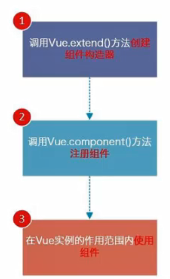

## 简单认识Vue

* 读音

* Vue 是渐进式框架
  
  1. 渐进式意味着你可以将Vue作为你应用的一部分嵌入其中，带来更丰富的交互体验。
  
  2. 或者如果你希望将更多的业务逻辑使用Vue实现，那么Vue的核心库及其生态系统，比如Core+Vue-router+Vuex,也可以满足你各种各样的需求。

* Vue有很多特点和Web开发中常见的高级功能
  
  1. 解耦视图和数据
  
  2. 可复用的组件
  
  3. 前端路由技术
  
  4. 状态管理
  
  5. 虚拟DOM

* 做到数据和界面彻底分离

## Vue中的MVVM


* View层：
  
  > 视图层
  
  1. 在我们前端开发中，通常就是DOM层。
  
  2. 主要的作用是给用户展示各种信息。

* Model层：
  
  > 数据层
  
  1. 数据可能是我们固定的死数据，更多的是来自我们服务器，从网络上请求下来的数据。
  
  2. 在我们计数器的案例中，就是后面抽取出来的obj，当然，里面的数据可能没有这么简单。

* VueModel层：
  
  > 视图模型层
  
  1. 视图模型层是View和Model沟通的桥梁。
  
  2. 一方面它实现了Data Binding，也就是数据绑定，将Model的改变实时地反应到View中。
  
  3. 另一方面它实现了DOM Listener，也就是DOM监听，当DOM发生一些事件（点击、滚动、touch等）时，可以监听到，并在需要的情况下改变对应的Data。

## Vue的options

* **el**:
  
  类型：string | HTMLElement
  
  作用：决定之后Vue实例会管理哪一个DOM。

* **data**:
  
  类型：Object | Function（组件当中data必须是一个函数）
  
  作用：Vue实例对应的数据对象。

* **methods**:
  
  类型：{[key:string]:Function}
  
  作用：定义属于Vue的一些方法，可以在其他地方调用，也可以在指令中使用。

## Vue的生命周期

* 生命周期：事物从诞生到消亡的整个过程。
* Vue生命周期：自己找图了解。

## Vue插值操作

* **Mustache语法：**
  
  通过双大括号 {{   }} 将数据插入HTML 。

* **v-once指令:**
  
  1. v-once后面不需要跟任何表达式。
  
  2. 该指令表示元素和组件只渲染一次，不会随着数据的改变而改变。 

* **v-html指令:**
  
  1. 该指令后往往跟上一个string的类型。
  2. 会将string的html解析出来并进行渲染。

* **v-text指令：**
  
  类似mustache将数据显示在界面中，接受一个string类型，但是会覆盖标签的内容。

* **v-pre指令：**
  
  用于跳过这个元素和它子元素的编译过程，用于显示原本的Mustache语法。

* **v-cloak指令：**
  
  cloak:斗篷。****
  
  某些情况下，浏览器可能会直接显示出未编译的Mustache标签，
  
  Vue解析之后会把标签中的v-cloak属性删掉。

## v-bind

> 作用：动态绑定
> 
> ​            用于绑定一个或多个属性值，或者像另一个组件传递props值
> 
> 缩写：：（一个冒号） 
> 
> 预期：any(with argument) | Object(without argument)
> 
> 参数：attrOrProp(optional) 

* **动态绑定class(对象语法)**
  
  用法一，直接通过{}绑定一个类
  
  ```javascript
  <h2 :class="{'active': isActive}"></h2>
  ```
  
  用法二，通过判断，传入多个值
  
  ```javascript
  <h2 :class="{'active': isActive, 'line': isLine}"></h2>
  ```
  
  用法三，和普通的类同时存在，并不冲突
  
  ```javascript
  <h2 class="title" :class="{'active': isActive, 'line': isLine}"></h2>
  ```
  
  用法四,如果过于复杂，可以放在一个methods或computed中
  
  ```javascript
  <h2 :class="{"classes"}"></h2>
  ```

* **动态绑定class(数组语法)**
  
  和对象语法差不多，但是很不常用。

* **动态绑定style(对象语法)**
  
  ```javascript
  <h2 :style:"{color: finalColor}"></h2>
  ```

* **动态绑定style(数组语法)**
  
  ```javascript
  <h2 :style:"[baseStyle1,baseStyle2]"></h2>
  ```
  
  和对象语法差不多，但是很不常用。

## Vue计算属性

* 有时我们需要对数据进行一些转化后再显示，或者将多个数据结合起来进行显示。

* 计算属性写在computed选项中。

* 计算属性会进行缓存，如果多次使用，计算属性只会调用一次。

* 计算属性有set方法和get方法，但一般不使用set方法，为只读属性

* 计算属性和methods的区别：
  
  1. 计算属性会进行缓存，如果多次使用，计算属性只会调用一次。
  2. methods每次使用调用一次函数，性能低

## ES6 块级作用域let和var和const

* 看vscode的笔记
* 闭包：函数有自己的作用域，函数有自己的i就不用其他地方的i

## ES6 const的使用和注意

* 在很多语言中已经存在，比如C/C++，作用是将某个变量修饰为常量。

* 在javascript中也是如此，使用const修饰的标识符为常量，不可以再次赋值。

* 用const来保证数据的安全性。

* 在开发中优先使用const，只有需要改变标识符时才使用let。
  
  ```javascript
  const a = 20; //定义时必须初始化
  a = 30; //错误，不能修改
  ```
  
  ```javascript
  const obj = {
    name = 'zhou'
  }
  obj.name = 'jiahui'; //可以修改对象内部的属性
  ```

* const声明是指向一个内存地址，不能修改指向，能修改地址里面的值。

## ES6 字面量增强写法

* 属性增强写法

```javascript
//ES5的写法
const name = 'zhou';
const age = 18;
const obj = {
  name: name,
  age: age
}
//ES6的写法
const obj = {
  name,
  age
}
```

* 函数增强写法

```javascript
//ES5的写法
const obj = {
  run:function() {

  }
}
//ES6的写法
const obj = {
  run() {

  }
}
```

## Vue事件监听

* vue使用**v-on**监听事件

* 缩写：@

* 预期：Function | Inline Statement | Object

* 参数：event

#### **v-on参数**

1. 如果方法不需要额外参数，那么方法后的（）可以不添加。
2. 如果需要同时传入某个参数，同时需要event时，可以通过$event传入事件。

#### v-on修饰符

1. .stop  -  调用event.stopPropagation()
2. .prevent  -  调用 event.preventDefault()
3. .{KeyCode | keyAlias}  -  只当事件师从特定键触发时才触发返回
4. .native  -  监听组件根元素的原生事件
5. .once  -  只触发一次回调

## 条件判断

* v-if、v-else-if、v-else：
  
  这三条指令与javaScript的条件语句if  else  else if类似
  
  Vue的条件指令可以根据表达式在DOM中渲染或销毁元素或组件

* v-if的原理：
  
  v-if后面的条件为false时，对应的元素以及其子元素不会渲染
  
  也就是根本不会有对应的标签出现在DOM中

* v-show条件为false时，将display属性设置为none而已。

* 需要显示隐藏之间切片很频繁时，使用v-show
  
  当只有一次切换时，使用v-if

## 循环遍历

* v-for遍历数组和对象

* 官方推荐我们在使用v-for时，给对应的元素或组件添加上一个key属性

* 

## JS高阶函数

* 编程范式：命令式编程/声明式编程

* 编程范式：面向对象编程（第一公民：对象）/函数式编程（第一公民：函数）

* 熟悉三个函数filter / map / reduce 的使用

## 表单绑定 v-model

* 表单控件在开发中很常见，特别是对于用户信息的提交需要大量的表单。
* Vue中使用v-model 指令来实现表单元素和数据的双向绑定。
* v-model本质上包含两个操作：
  1. v-bind绑定一个value属性。
  2. v-on指令给当前元素绑定input事件。

#### 值绑定

* 应用v-bind给input动态绑定value值

#### 修饰符

* **lazy修饰符：**
  1. 默认情况下，v-model默认是在input事件中同步输入框的数据的
  2. 也就是说，一旦有数据发生改变相对应的data中的数据就会自动发生改变
  3. lazy修饰符可以让数据在失去焦点或者回车时才会更新
* **number修饰符：**
  1. 默认情况下，在输入框中无论我们输入的是字母还是数字，都会被当作字符串类型进行处理
  2. 但是如果我们希望处理的时数字类型，那么最好直接将内容当作数字处理
  3. number修饰符可以让在输入框中输入的内容自动转成数字类型
* **trim修饰符：**
  1. 如果输入的内容首尾有很多空格，通常我们希望将其去除
  2. trim修饰符可以过滤内容左右两边的空格

## Vue组件化思想

* 组件化是Vue.js中的重要思想：
  1. 它提供了一种抽象，让我们可以开发除一个个可独立复用的小组件来构造我们的应用。
  2. 任何应用都会被抽象成一颗组件树。
* 组件化思想的应用：
  1. 有了组件化的思想，我们在之后的开发中就要充分地利用它。
  2. 尽可能地将页面拆分成一个个小的、可复用的组件。
  3. 这样我们的代码更加方便组织和管理，并且拓展性也更强。

#### 创建组件的基本步骤

* 三步：
  
  1. 创建组件构造器
  
  2. 注册组件
  
  3. 使用组件



* 1.Vue.extend():
  
  * 调用Vue.extend()创建的是一个组件构造器。
  * 通常在创建组件构造器时，传入template代表我们自定义组件的模板。
  * 该模板就是在使用到组件的地方，要显示的html代码。

* 2.Vue.components():
  
  * 调用Vue.components是将刚才的组件构造器注册为一个组件，并且给它起一个组件的标签名称。
  * 所以需要传递两个参数：1、注册组件的标签名 2、组件构造器

* 3.组件挂载在Vue实例中

#### 全局组件和局部组件

#### 父组件和子组件

#### 注册组件语法糖

* 省去extend()步骤，直接用一个对象来代替

#### 模板分离写法

* 使用 script 标签
* 使用 template 标签

#### 组件数据的存放

* 组件不能访问Vue实例的数据，有自己保存数据的地方

* 组件对象也有data,methods等属性

* data属性必须是一个函数，函数返回一个对象

#### 父子组件的通信

* 在开发中，往往让大组件请求数据发送到小组件。

* 父组件通过props向子组件传递数据。

* 子组件通过事件向父组件发送消息。

* Vue实例和子组件的通信和父组件和子组件的通信是一样的。


#### 父子组件的访问方式：$children

* 父组件直接访问子组件：$children或$refs
  
  * this.$children是一个数组类型，它包含所有子组件对象，很不常用。
  * this.%refs是对象类型，非常地常用

* 子组件访问父组件：$parent（同children很不常用）

* 子组件访问根组件：$root (直接访问vue实例)

#### 插槽slot

* 组件的插槽可以决定组件内部的一些内容到底展示什么。

#### 编译作用域

* 父组件模板的所有东西都会在父级作用域编译
* 子组件模板的所有东西都会在子级作用域编译

#### 作用域插槽

* 父组件替换插槽的标签，但是内容由子组件来提供

## 模块化开发

* 解决命名冲突的问题，同时解决代码复用的问题。

#### CommonJS

* 模块化的两个核心：导出和导入

* CommonJS的导出
  
  * ```javascript
    module.exports = {
        flag:true,
        test(a,b) {
            return a+b
        },
        demo(a,b) {
            return a*b
        }
    }
    ```

* CommonJS的导入
  
  * ```javascript
    let{test,demo,flag} = require('moduleA')
    ```

#### ES6的模块化

* 导出变量：
  
  ```javascript
  1.
  let name = 'lihua'
  export{name}
  
  2.
  export let name = 'lihua'
  ```

* 导入变量
  
  ```javascript
  export{name} from"./***.js"
  ```

* export default
  
  某些情况下，一个模块中包含的某个功能，我们并不希望给这个功能命名，而且让导入者可以自己来命名。
  
  * 这个时候可以使用export。
  * export default在同一个模块中只能存在一个。
