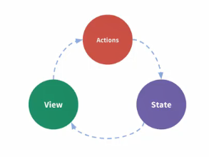
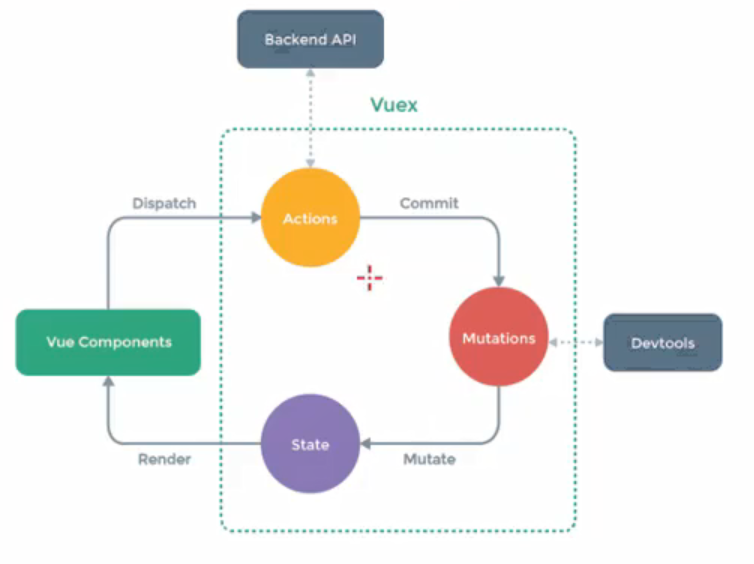

## 一、Vuex是做什么的？

* Vuex 是一个专为vue.js应用程序开发的**状态管理模式**。
  
  * 它采用 **集中式存储管理** 应用的所有组件的状态，并以相应的规则保证状态以一种可预测的方式发生变化。
  * Vuex也集成到Vue的官方调试工具 **devtools extenstion** ，提供了诸如零配置的 time-travel 调试、状态快照导入导出等高级调试功能。

* 状态管理是什么
  
  * 把需要多个组件共享的变量全部存储在一个对象里面
  * 然后将这个对象放在顶层的Vue中，让其他组件可以使用
  * 那么多个组件可以共享这个对象中的所有变量属性了
  * 而且是响应式的

### 我们一般管理什么状态呢

* 用户的登录状态、用户名称、头像、地理信息等等
* 商品的收藏等、购物车中的物品等

## 二、界面的状态管理

### 1.1单界面状态管理



* 状态state在界面view中显示，view的行为action又影响状态

### 1.2多界面状态管理

* 用vuex
* 异步操作：action
* 同步操作：通过mutation的方式改变数据



* 简单步骤
  1. 提取出一个公共的store对象，用于保存多个组件中共享的状态
  2. 将store对象放置在new Vue中
  3. 在其他组件中使用store对象保存的状态：
     * 通过this.$store.state属性访问状态
     * 通过this.$store.commit('mutation中方法')来修改状态

## 三、vuex核心概念

* state单一状态树
  
  * 一个项目里我们只使用一个store

* **getters** 
  
  * 类似于计算属性，对state的数据进行处理
  * getters里的函数有两个参数state,getters
  * getters默认不能传参数，如果要传参只能让getters本身返回另一个函数

### Mutation状态更新

* Vuex的store状态的更新唯一方式：**提交Mutation**

* mutation的两部分
  
  * 字符串的事件类型(type)
  * 一个回调函数(handler)，该回调函数的第一个参数就是state

* mutation更新数据时可以传递参数(载荷payload)
  
  ```javascript
  this.$store.commit("addCount",count)
  ```
  
  参数可以是对象

### Mutation提交风格

* 用commit提交是一种风格

* 第二种
  
  ```javascript
      this.$store.commit({
          type: "incrementCount",
          count,
        });
  ```
  
  mutation接受时的第二个参数是整个对象而不是传过来的参数了

### Mutation的响应式规则

* Vuex的store的数据是响应式的，当state的数据发生改变时，Vue组件会自动更新
* 这需要遵循一定的规则
  * 提前在store中定义好属性
  * 给state添加新属性时，两种方法
    * 一、使用Vue.set(obj,'newProp',132)
    * 二、用新对象给就对象重新赋值
  * 删除state的属性时
    * Vue.delete(obj,'Prop')

### Mutation常量

* 把mutation的函数名改用常量

### Mutation同步函数

* Vuex要求mutation里的方法必须是同步方法
  
  * 异步操作的话devtools不能跟踪到操作的完成

* 要是有异步操作，就要用我们的action啦

### Action的基本定义

* action类似于mutation但是是用来代替mution进行异步操作的
* action可以返回promise,在dispatch可以使用promise

### Modules的使用

* modules就是模块的意思
* Vuex允许我们将store分割成模块，每个模块拥有自己的state/mutations/actions/getters等

## 四、项目结构
