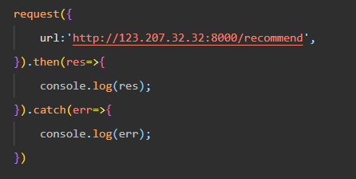
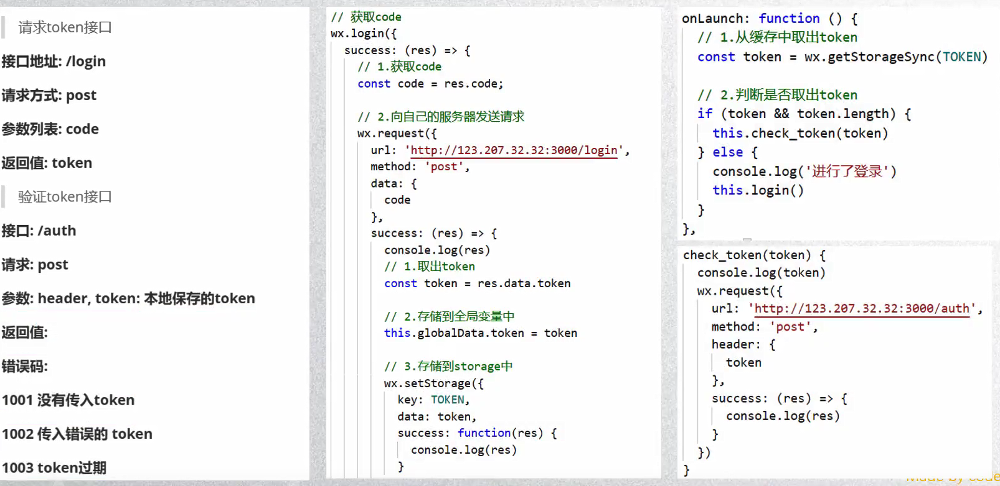

## 小程序的配置文件

* project.config.json:项目配置文件，比如项目名称，appid等
* witemap.json:小程序搜索相关
* app.json:全局配置
* page.json:页面配置

## 全局配置

* pages:页面路径表

  * 用于指定小程序由哪些页面组成，每一项都对应一个页面的路径信息
  * 小程序中所有页面都是必须在pages中进行注册的

* window：全局的默认窗口展示

  * 用户指定窗口如何展示，其中还包含了很多其他属性

* tabBar:顶部tab栏的展示

  

### 页面配置

* 页面配置会覆盖全局配置

## 小程序的双线程模型

* 微信客户端是小程序的宿主环境
  * 宿主环境为了执行小程序的各种文件：wxml文件、wxss文件、js文件
  * 提供了小程序的双线程模型
* 
* 

#### 初始化渲染

* WXML可以先转成js对象，再渲染出真正的DOM树

## 小程序的启动流程

## 注册APP时做什么

* 判断小程序的进入场景
* 监听生命周期函数，执行对应的业务逻辑
* 可以将共享数据放在App()实例里

## 注册page时干什么

* 绑定初始化数据，生命周期回调，事件处理函数
* 其他的监听（滚动事件,上拉刷新，下拉加载等等）

### page的生命周期图

## 小程序组件

#### Text组件

* 用于显示文本，是行内元素

#### Button组件

* 按钮

* open-types属性
  * open-type用户获取一些特殊的权限，可以绑定一些特殊的事件

#### view组件

* 视图组件（块级元素，独占一行，通常用作容器组件）

#### image组件

* 用于显示图片

#### input组件

* 用于接受用户的输入信息，也是开发中常见的

#### scroll-view

* 局部滚动区域

### 组件的共同属性

* id / class / style / hidden / 

## WXSS的选择器

* 跟css一样

### wxss的扩展

* 尺寸单位：rpx  适配屏幕尺寸
* 在iphone6中  :  2px = 1rpx

## WXSS- mustach语法

和vue一样

## wx:if 和 wx:for

### block标签

* block不是组件，只是一个包裹标签，不会在页面中渲染，只接受控制属性
* 将需要遍历或判断的内容进行包裹
* 相比于view性能更高

## template模板

* 使用name属性作为模板的名字，然后在 template/ 里定义代码片段

## wxml的引入

* import或include
* import不能套娃导入
* include可以将目标文件中除了 template/  wxs/ 外的整个代码引入，相当于是拷贝到include 的位置
* include可以套娃引入

## WXS模块

* WeiXin Script 是小程序的一套脚本语言，结合WXML，可以构建出页面结构
*  WXS 和 JS 不太一致，不过基本上是一致的

* 在wxml里不能直接调用page/component中定义的函数
* 但是我们想用函数处理数据，就要用到wxs了

## 事件处理

#### 事件如何处理

* 事件通过bind/catch这个属性绑定在组件上
* bindtag  ==  bind:tag

#### 事件类型

* 某些组件有自己特定的事件（input / scroll-view）

* 常见事件

  

#### 事件对象

* 

* touches和changedTouches的区别
  * 在touchend中的不同
  * 在多手指触摸时不同

* target 和 currentTarget 的区别
  * target记录产生事件的组件
  * currentTarget记录触发事件的组件

* 事件通过data-name="index/item"传递数据

## 组件化开发

### 自定义组件的注意事项

* 名称只能小写字母，中划线，下划线，数字
* 组件可以嵌套引用
* 不能用wx做前缀
* 可以在app.json注册全局组件

### 自定义组件的样式细节

* 自定义组件里的样式不会对外部样式有影响，（互不影响）

* 防止意外，组件里不要用   id / 属性 / 标签   选择器

* 如何共享样式？

  

### 组件和页面的通信

* 数据传递：props

  

* 样式传递：类名不能有大写字母

  
  
  ## 插槽

* 和vue一样
* 具名插槽的使用
  * 给插槽起名字name
  * 必须在component对象中添加一个选项：
  * options:{
  * ​    multipleSlots:true
  * }

## Component构造器

* 

## 网络请求

* 微信的专门API接口：wx:request(Object,Object)

#### 网络请求数据封装

* 降低网络请求和wx.request的耦合度
* 

## 展示弹窗

* 四种方式：showToast、showModal、showLoading、showActionSheet

## 页面分享

## 小程序登录流程

## 页面跳转

* 两种方式：navigator  和  小程序API
* navigator的open-type属性
  * 
